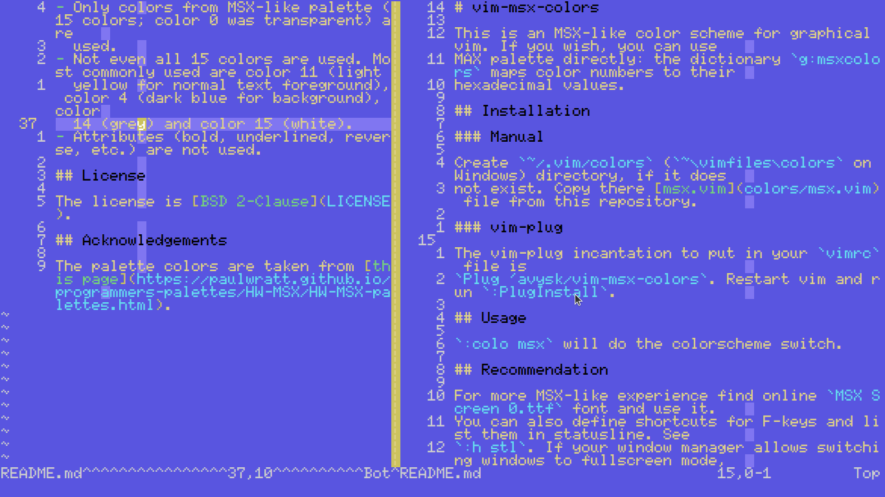

# vim-msx-colors

This is an MSX-like color scheme for graphical vim. If you wish, you can use
MSX palette directly: the dictionary `g:msxcolors` maps color numbers to their
hexadecimal values.



The example is out of date. The current version of the colorscheme is using
white as a color for a normal text.

## Installation

### Manual

Create `~/.vim/colors` (`~\vimfiles\colors` on Windows) directory, if it does
not exist. Copy there [msx.vim](colors/msx.vim) file from this repository.

### vim-plug

The vim-plug incantation to put in your `vimrc` file is
`Plug 'avysk/vim-msx-colors`. Restart vim and run `:PlugInstall`.

## Usage

`:colo msx` will do the colorscheme switch.

## Recommendation

For more MSX-like experience find online `MSX Screen 0.ttf` font and use it
(see below for one possible source).

You can also define shortcuts for F-keys and list them in statusline. See
`:h stl`. If your window manager allows switching windows to fullscreen mode,
using it for gvim makes things more authentic.

## Limitations

- Only GUI vim is supported. The colorscheme will not work in a terminal
  (though it will probably work if `termguicolors` is turned on).
- Only colors from MSX-like palette (15 colors; color 0 was transparent) are
  used.
- Not even all 15 colors are used. Most commonly used are color 11 (light
  yellow), color 4 (dark blue for background), color 14 (grey) and color 15
  (white for normal text background).
- If you have rainbow parentheses plugin, supporting `ToggleRainbowOff`
  command, then `ToggleRainbowOn` will be automatically executed when
  colorscheme is loaded.
- If you load colorscheme automatically and you still have problems
  with rainbow parentheses (for example, in vimscript files) try the following:

```vimscript
augroup MSXColors
  autocommand!
  autocommand BufEnter * ++once colo msx
augroup END
```

## License

The license is [MIT](LICENSE).

## Acknowledgements

The palette colors are taken from [this page](https://paulwratt.github.io/programmers-palettes/HW-MSX/HW-MSX-palettes.html).

I use the font from [here](http://www.ateijelo.com/blog/2016/09/13/making-an-msx-font).
